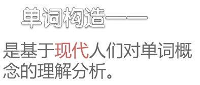
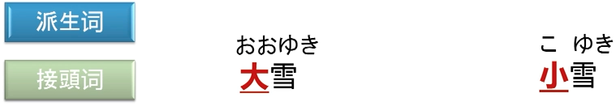
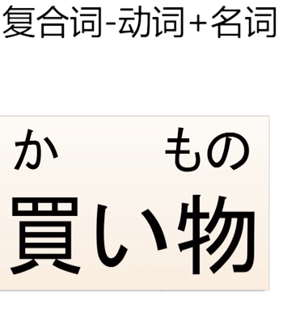

# 第一单元 假名：熟悉的陌生字

## 第一节 日语特征

1. 文字

    平假名：由汉字草书演变而来

    片假名：由汉字笔画演变而来

    汉字：繁体汉字

    也包含罗马字和数字

2. 形态
   黏着语：词干（语干）+词缀（附属语）
   不同的语法功能用不同的词来表示。
   （维吾尔语，土耳其语，朝鲜语，蒙古语，世界语等都是黏着语）

   

   
3. 语序

   SOV：主语宾语谓语

   区分主语谓语，根据后面跟的词缀区分

## 第二节 五十音图

# 第二单元 单词：初见的老朋友

## 第一讲 单词发音

音拍：保持每一拍时间长度一致

声调：保持高低两层声调

## 第二讲 单词来源

和语词：日本固有的名词，包括大部分动词、大部分形容词、所有助词、所有助动词

大多数采用训读

汉语词：大多数采用音读；汉语词 不等于 汉语里的词；

广义的汉语又叫做字音语，包括：梵语注音（外来语）、中国汉语、和制汉语、和汉混合语（混合语）、熟字训（和语词）；我们通常所说的汉语词主要是来自中国的汉语词以及日本人根据汉语造词法创造出来的汉语词（即中国汉语、和制汉语）。

中国汉语包括吴音、汉音、唐宋音、华制新汉语

和制汉语

外来语：

混合语：外来语和汉语词或者和语词混合成混合语

总结：

## 第三讲 单词构造

意思：						超级无敌快；						神经很大条

意思：像小孩子一样：	小孩子有小孩子的样子		不是小孩子却表现出了小孩子的样子

