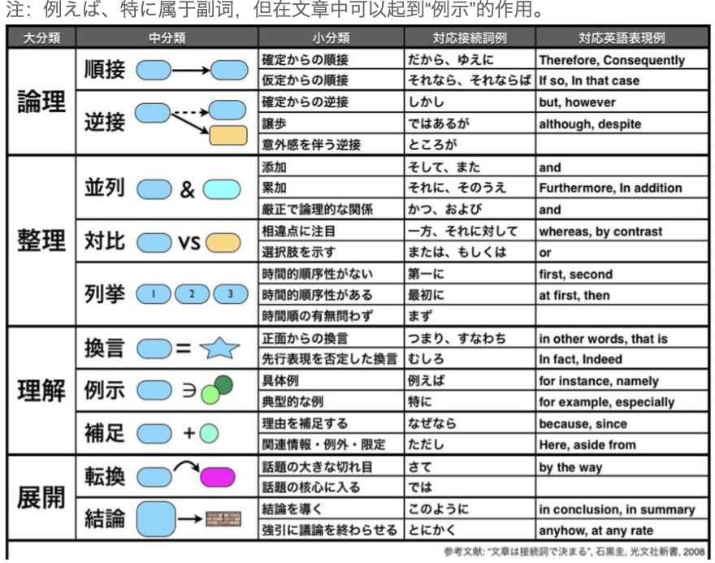
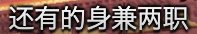
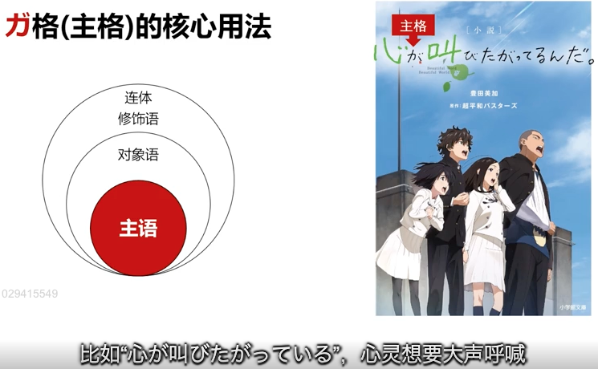
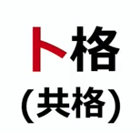
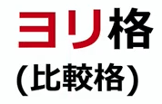
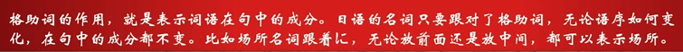

# 第一单元 假名：熟悉的陌生字

## 第一节 日语特征

1. 文字

   平假名：由汉字草书演变而来

   片假名：由汉字笔画演变而来

   汉字：繁体汉字

   也包含罗马字和数字
2. 形态
   黏着语：词干（语干）+词缀（附属语）
   不同的语法功能用不同的词来表示。
   （维吾尔语，土耳其语，朝鲜语，蒙古语，世界语等都是黏着语）

   

   
3. 语序

   SOV：主语宾语谓语

   区分主语谓语，根据后面跟的词缀区分

## 第二节 五十音图

# 第二单元 单词：初见的老朋友

## 第一讲 单词发音

音拍：保持每一拍时间长度一致

声调：保持高低两层声调

## 第二讲 单词来源

和语词：日本固有的名词，包括大部分动词、大部分形容词、所有助词、所有助动词

大多数采用训读

汉语词：大多数采用音读；汉语词 不等于 汉语里的词；

广义的汉语又叫做字音语，包括：梵语注音（外来语）、中国汉语、和制汉语、和汉混合语（混合语）、熟字训（和语词）；我们通常所说的汉语词主要是来自中国的汉语词以及日本人根据汉语造词法创造出来的汉语词（即中国汉语、和制汉语）。

中国汉语包括吴音、汉音、唐宋音、华制新汉语

和制汉语

外来语：

混合语：外来语和汉语词或者和语词混合成混合语

总结：

## 第三讲 单词构造

意思：						超级无敌快；						神经很大条

意思：像小孩子一样：	小孩子有小孩子的样子		不是小孩子却表现出了小孩子的样子

# 第三单元 词汇：无边的大森林

## 第一节 自然生活

雨相关的词汇1000+个。

鱼字旁的汉字排行第一多，木字旁的汉字排行第二多。

季节词汇：

3月：赏樱花，吃花团子，女儿节，桃花节，吃菱饼等

5月：儿童节，端午节，吃粽子、柏饼。家里有男孩要挂上鲤鱼幡。母亲节

6月：父亲节

7月：七夕，在竹子上挂些长条诗笺许个愿；海水浴

8月：暑假，浴衣+团扇 看烟花；盂兰盆舞。

9月：中秋节赏月，吃月团子；时令的果蔬：葡萄、柿子、梨、红薯等。

10月：万圣节。

11月：753:三岁或者五岁的男孩，三岁或者七岁的女孩，穿上和服，去神社祈福，吃千岁糖；赏红叶，赏黄叶银杏。

12月：圣诞节，日本人会把平安夜当作情人节过，或者求婚；玩雪、滑雪，在滑雪场过个年看看除夕夜的烟花。

1月：新年在家吃年菜、年糕汤，在家里摆上镜饼、门松，有时间约小伙伴打羽毛毽子。

2月：立春前一天要过节分，还要撒豆子，同时大喊：

（把鬼赶出去，把福迎进来）；

情人节：女生送巧克力给自己喜欢的男生，（有一种：人情巧克力）。

## 第二节 精神世界

## 第三节 品词分类

# 第四单元 体言：单纯的小王子

## 第一讲 名词和数词

总结：

形式名词讲解

## 第二讲 代名词

分为人称代名词和指示代名词。

## 第三讲 副词和接续词

# 第五单元 用言 多变的小狐狸

## 第一节 形容词和形容动词

 = 

形容词的活用

终止形和连体形跟基本型的形态是一样的，但是后续的内容不同。

假定形：

形容动词的活用：

形容动词的终止形和基本型的形态一样。

如：

总结：

## 第二节 动词的活用

动词的形态：

不规则动词：

总结：

## 第三节 自动词和他动词

既可以做自动词也可以做他动词：

为何要区分自动词与他动词：

总结：

# 第六单元 助词：带刺的玫瑰花

## 第一节 格助词

使用了两个ni，都是表示动作的归着点，接时间名词的时候表示时间点，接地点名词的时候表示移动动作的目的地。

he：侧重表达移动的**方向**是学校、家、办公室。

（这里两者可以互换）

ni：侧重表达移动的**目的地**是学校、家、办公室。

下面两个句子，两者不能互换：

e.g. 

## 第二节 接续助词

## 第三节 副助词
