# 日本大众文化（中国mooc）

# 第一单元

## 第一讲 日本广告艺术鉴赏

浓缩了日本文化精神和日式审美特点

1. 系列化广告：有的持续十几年
2. 融入传统文化，反差吸睛
3. 善用日式小清新风格
4. 追求诙谐幽默
5. 发达的偶像文化，开创广告新局面

## 第二讲 东野圭吾的推理世界

日本传统推理小说经历的三个时期：

1. 英国侦探小说：柯南道尔《福尔摩斯探案集》；阿加莎 克里斯蒂《东方快车谋杀案》《尼罗河谋杀案》
2. 美国侦探小说：爱德加 爱伦 坡 《莫尔格街谋杀案》
3. 日本推理小说：

   （1） 20世纪40年代：江户川乱步-本格派代表作家《恶魔》《孤岛之鬼》（注重现实主义、逻辑推理和意想不到的情节），横沟正史-变格派代表作家《本阵杀人事件》（更强调浪漫主义和逻辑推理）；

   （2）20世纪50年代：松本清张-社会派代表作家《点和线》（在注重逻辑推理的同时，更探索犯罪的社会根源以及反应人们的精神困顿）；
   （3）20世纪70年代：森村诚一-新社会派代表作家 《人间的证明》（凸显社会责任感，关注人性）；

   （4）20世纪80年代：岛田庄司-新本格派代表作家（趋向现实主义，关注事件案情）

   （5）20世纪90年代：“失去的十年"（历经 奥姆真理教事件、阪神大地震、泡沫经济），写实本格派更关注社会现实和人性。

东野圭吾小说的三个阶段：

（1）80年代：酝酿期

（2）90年代：成熟期

（3）2000年至今：完善期

东野圭吾推理小说的主题：

1. 反映社会现实，并揭露悲剧产生的根源：《幻夜》《分身》《宿命》《湖边凶杀案》《彷徨之刃》
2. 关注科学的滥用与惩罚：《分身》《宿命》
3. 关注家庭问题：《白夜行》《红手指》《麒麟之翼》
4. 关注人性：《信》
5. 注重塑造女性形象：《白夜行》《红手指》

与本土推理小说比较：

主题设置方面：摈弃离奇的情节，关注普通人的现实生活。

创作态度方面：更关注人性和社会问题。

推理方式层面：与传统的托梦、经验判断不同，更注重实证和逻辑思维

东野圭吾作品广泛传播因素：

1. 经济发展因素
2. 城市化进程因素
3. 国民法律意识增强

# 第二单元

## 第三讲 日本垃圾文化

1970年第64次临时国会，甚至被称为“公害国会"。

1970年日本教育学家高桥敷教授撰写《丑陋的日本人》，历数日本人“乱丢垃圾、随地小便、从不排队和‘在动物园乱喂长颈鹿’"等不文明行为。

垃圾减产与循环的一个开端：沼津模式

1973年10月开始，为抗议垃圾问题，沼津市民开启了长达500天的“垃圾战争"，这一行为也拉开了日本“垃圾分类"的序幕。——垃圾战争

1974年7月：沼津市清洁工和志愿者号召展开垃圾分类工作，针对资源化垃圾进行再回收处理。——开始分类

1975年4月：可燃、不可燃和资源型垃圾——开始实施新的分类方法

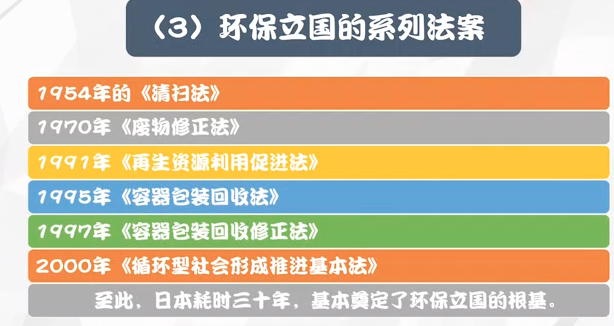

日本：形成了公民为中心的社会全方位参与的垃圾分类管理机制

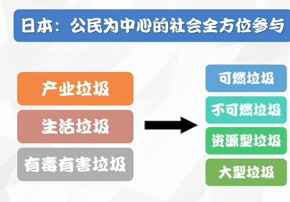

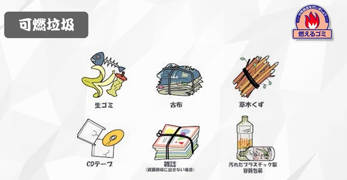

可燃垃圾：每次丢弃的量不能超过45L，每周可投放2次。

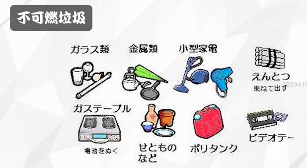

不可燃垃圾：每次丢弃的量不能超过45L，隔周可投放1次。

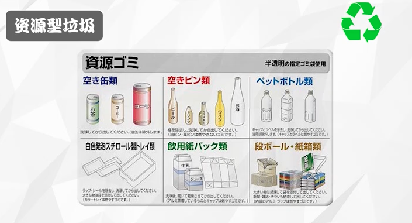

资源型垃圾：每周可投放1次

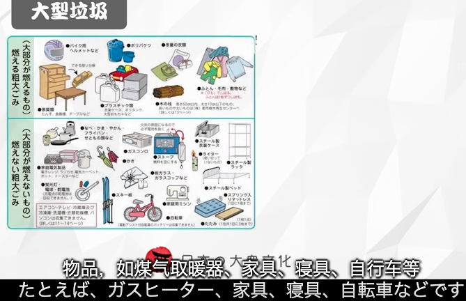

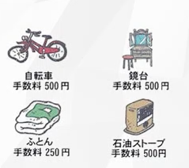

大型垃圾：一般超过30cm见方的物品，不能随便投放，需要缴纳相应的费用。

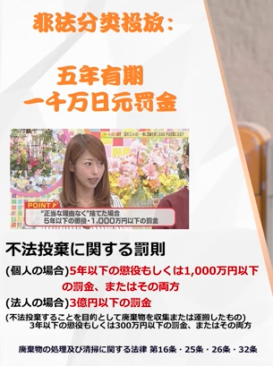

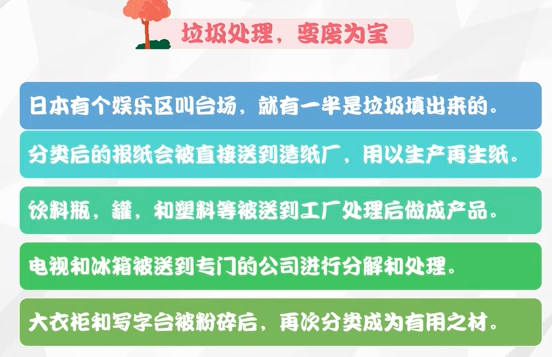

儿童环保教育深入人心。

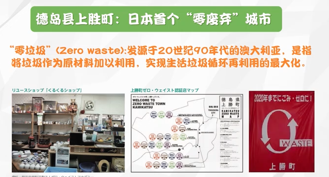

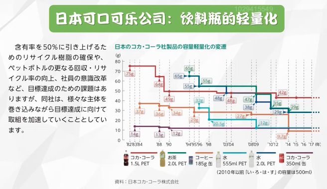

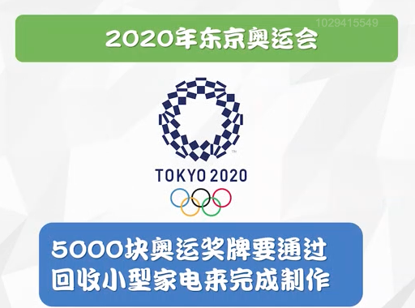

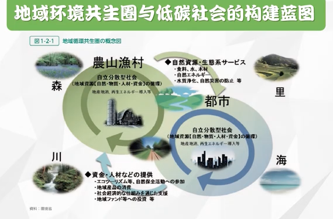

## 第四讲 日本家庭的变与不变

以前：女性结婚就回归家庭，男主外，女主内。

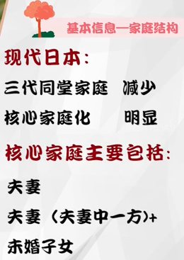

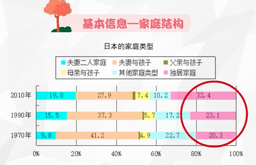

（日本的晚婚化、未婚化甚至不婚化；日本的老龄化；离婚等）

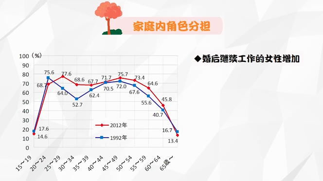

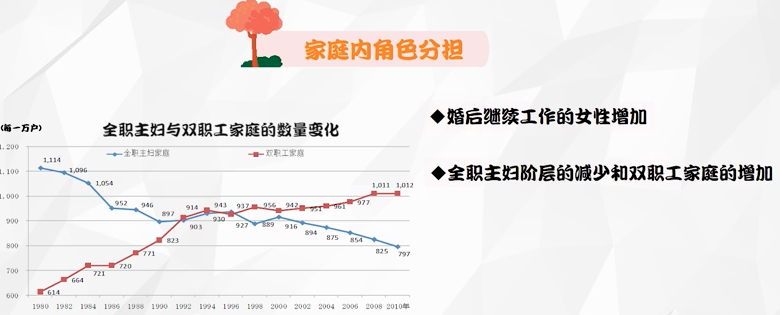

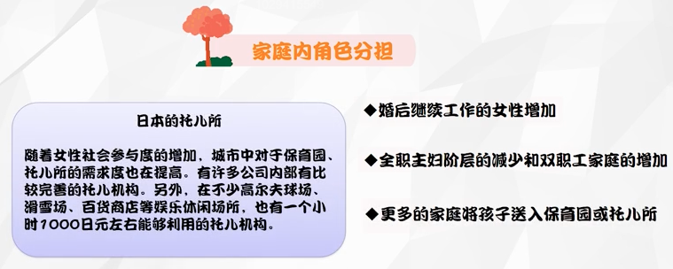

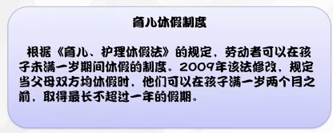

老年护理：

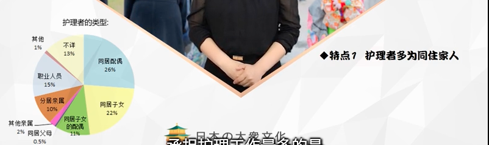

 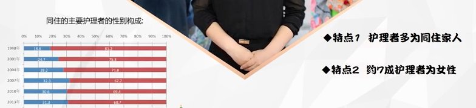

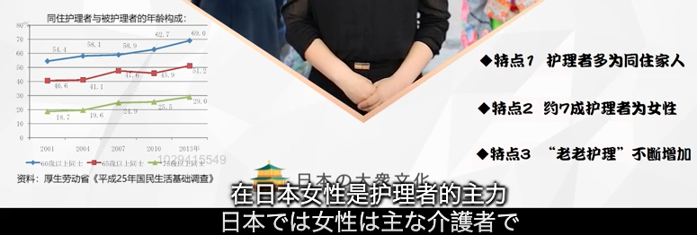

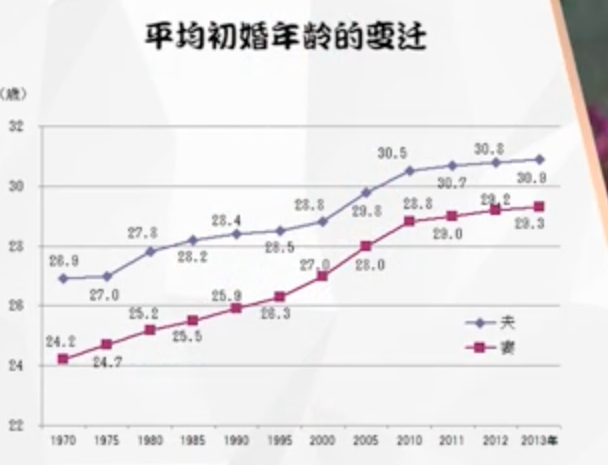

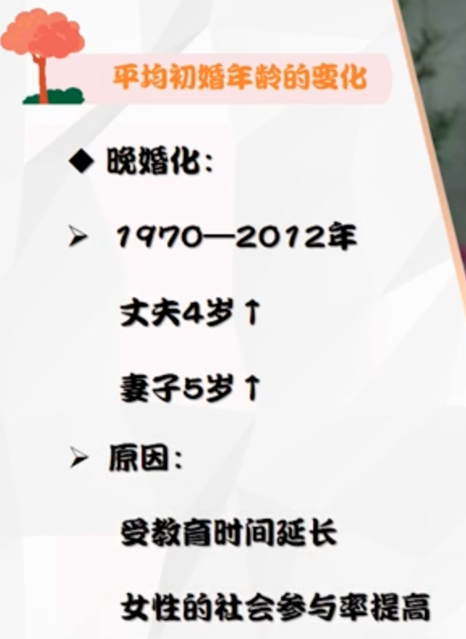

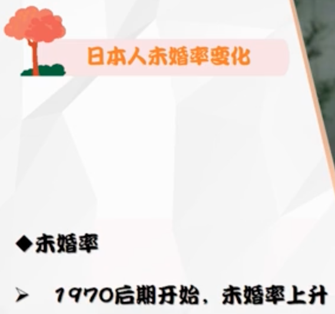

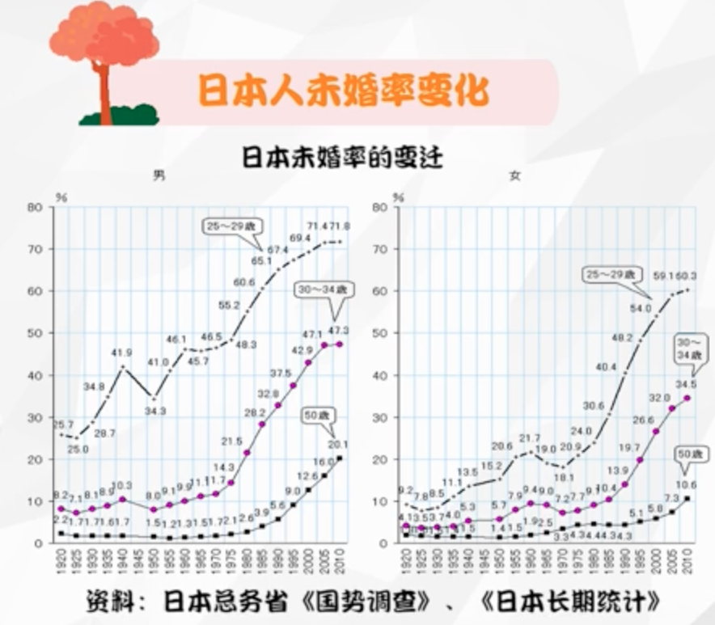

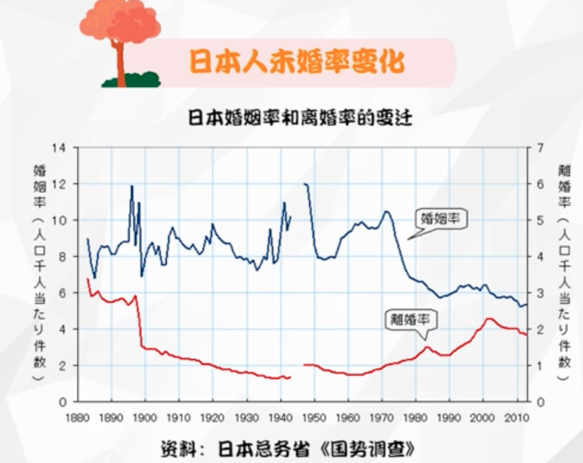

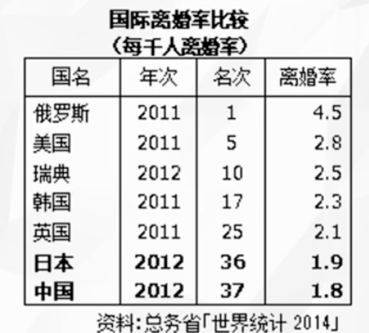

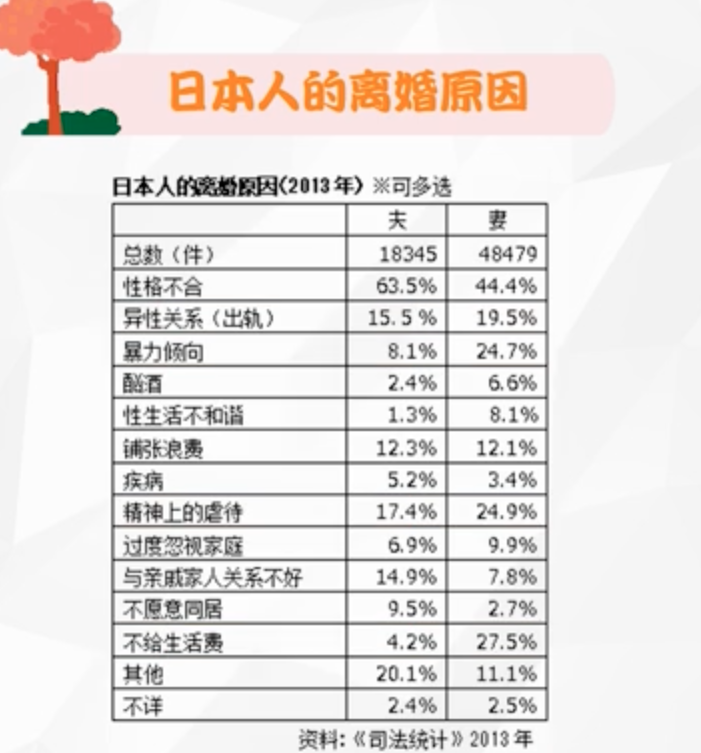

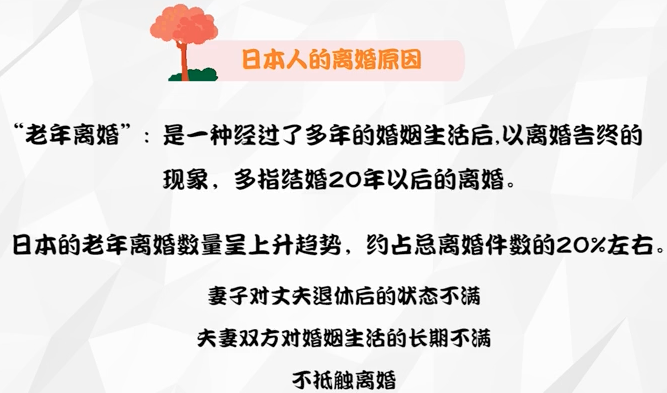

# 第三单元

# 第四单元

# 第五单元

# 第六单元

# 第七单元

# 第八单元

# 第九单元

# 第十单元
